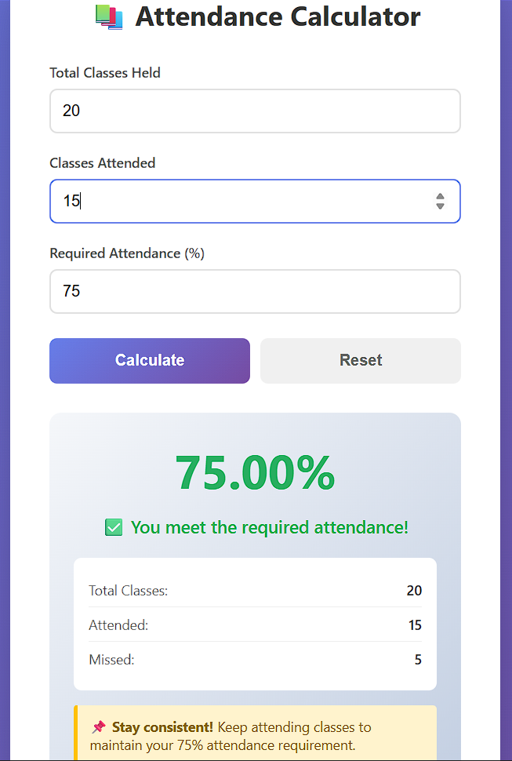
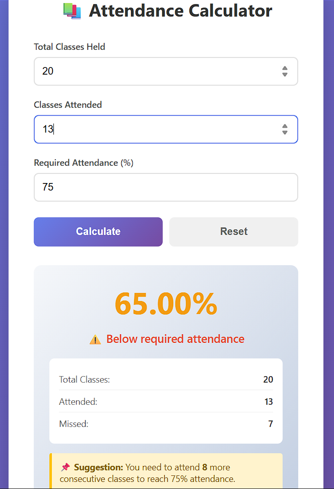

# 📋 Attendance Monitor

A simple and interactive **Attendance Monitoring Web App** built using **HTML, CSS, and JavaScript**.  
It helps track attendance efficiently with an easy-to-use interface.

I made this project based on my own knowledge and understanding during learning web dev basics.

## 🚀 Demo

[Live Demo](https://attendance-monitor.netlify.app/)

---

## 🚀 Features

-  Calculate the percentage of the attendance  
-  Display total number of class you can leave (if criteria matched)
-  Display total number of class you have to attend to meet the criteria
-  Automatic attendance calculation using JavaScript  
-  Data stored locally (no backend needed)  
-  Fully responsive design for all devices  

---

## 🛠️ Tech Stack

- **HTML5** – Structure of the web page  
- **CSS3** – Styling and layout  
- **JavaScript (ES6)** – Logic and interactivity  

---

## 💡 Future Enhancements
- Add export to Excel or PDF
- Include login system for teachers/admins
- Store attendance in a real database
- Add graph-based attendance reports

---
## 🧑‍💻 Author

**Aamir Neyazi**

